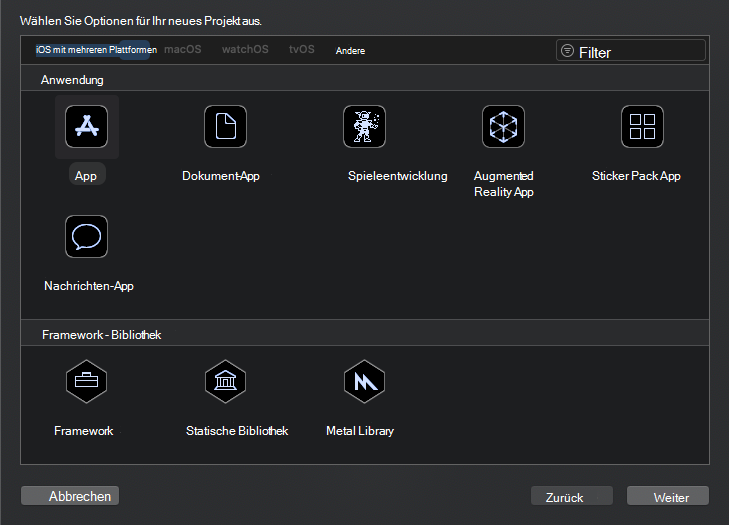
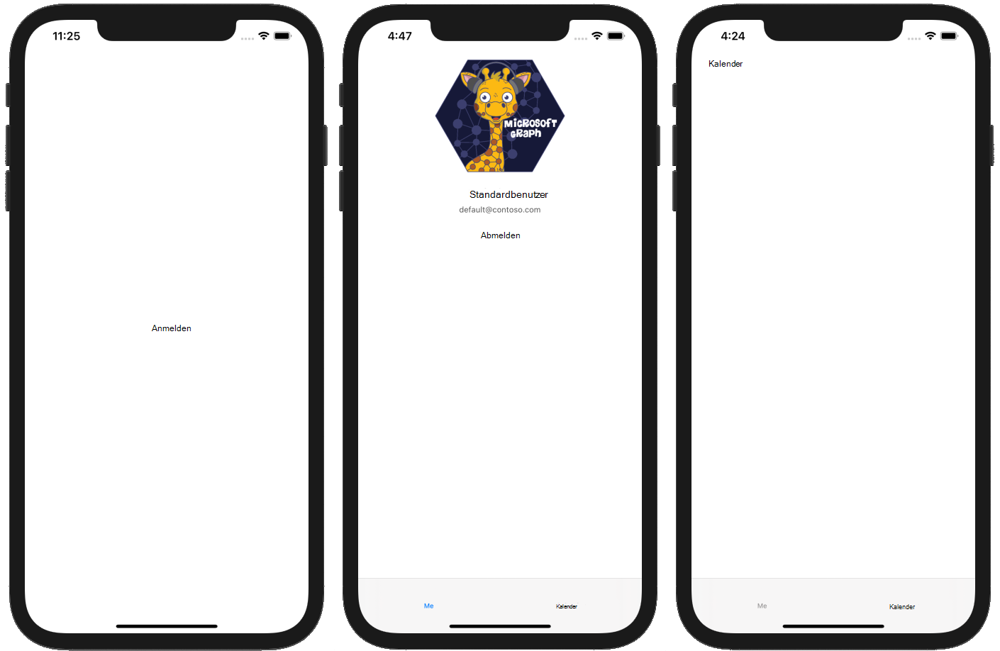

<!-- markdownlint-disable MD002 MD041 -->

<span data-ttu-id="85ac4-101">Erstellen Sie zunächst ein neues Swift-Projekt.</span><span class="sxs-lookup"><span data-stu-id="85ac4-101">Begin by creating a new Swift project.</span></span>

1. <span data-ttu-id="85ac4-102">Öffnen Sie Xcode.</span><span class="sxs-lookup"><span data-stu-id="85ac4-102">Open Xcode.</span></span> <span data-ttu-id="85ac4-103">Wählen Sie **im Menü "Datei"** **"Neu"** und dann **"Projekt" aus.**</span><span class="sxs-lookup"><span data-stu-id="85ac4-103">On the **File** menu, select **New**, then **Project**.</span></span>
1. <span data-ttu-id="85ac4-104">Wählen Sie die **App-Vorlage** und dann **"Weiter" aus.**</span><span class="sxs-lookup"><span data-stu-id="85ac4-104">Choose the **App** template and select **Next**.</span></span>

    

1. <span data-ttu-id="85ac4-106">Legen Sie **den Produktnamen auf** `GraphTutorial` und die Sprache **auf** **Swift .**</span><span class="sxs-lookup"><span data-stu-id="85ac4-106">Set the **Product Name** to `GraphTutorial` and the **Language** to **Swift**.</span></span>
1. <span data-ttu-id="85ac4-107">Füllen Sie die verbleibenden Felder aus, und wählen Sie **"Weiter" aus.**</span><span class="sxs-lookup"><span data-stu-id="85ac4-107">Fill in the remaining fields and select **Next**.</span></span>
1. <span data-ttu-id="85ac4-108">Wählen Sie einen Speicherort für das Projekt aus, und wählen Sie **"Erstellen" aus.**</span><span class="sxs-lookup"><span data-stu-id="85ac4-108">Choose a location for the project and select **Create**.</span></span>

## <a name="install-dependencies"></a><span data-ttu-id="85ac4-109">Installieren von Abhängigkeiten</span><span class="sxs-lookup"><span data-stu-id="85ac4-109">Install dependencies</span></span>

<span data-ttu-id="85ac4-110">Installieren Sie vor dem Wechsel einige zusätzliche Abhängigkeiten, die Sie später verwenden werden.</span><span class="sxs-lookup"><span data-stu-id="85ac4-110">Before moving on, install some additional dependencies that you will use later.</span></span>

- <span data-ttu-id="85ac4-111">[Microsoft Authentication Library (MSAL) für iOS](https://github.com/AzureAD/microsoft-authentication-library-for-objc) für die Authentifizierung bei Azure AD.</span><span class="sxs-lookup"><span data-stu-id="85ac4-111">[Microsoft Authentication Library (MSAL) for iOS](https://github.com/AzureAD/microsoft-authentication-library-for-objc) for authenticating to with Azure AD.</span></span>
- <span data-ttu-id="85ac4-112">[Microsoft Graph SDK für Objective C](https://github.com/microsoftgraph/msgraph-sdk-objc) für Aufrufe an Microsoft Graph.</span><span class="sxs-lookup"><span data-stu-id="85ac4-112">[Microsoft Graph SDK for Objective C](https://github.com/microsoftgraph/msgraph-sdk-objc) for making calls to Microsoft Graph.</span></span>
- <span data-ttu-id="85ac4-113">[Microsoft Graph Models SDK für Objective C](https://github.com/microsoftgraph/msgraph-sdk-objc-models) für stark typierte Objekte, die Microsoft #A0 wie Benutzer oder Ereignisse darstellen.</span><span class="sxs-lookup"><span data-stu-id="85ac4-113">[Microsoft Graph Models SDK for Objective C](https://github.com/microsoftgraph/msgraph-sdk-objc-models) for strongly-typed objects representing Microsoft Graph resources like users or events.</span></span>

1. <span data-ttu-id="85ac4-114">Beenden Sie Xcode.</span><span class="sxs-lookup"><span data-stu-id="85ac4-114">Quit Xcode.</span></span>
1. <span data-ttu-id="85ac4-115">Öffnen Sie Terminal, und ändern Sie das Verzeichnis in den Speicherort Ihres **GraphTutorial-Projekts.**</span><span class="sxs-lookup"><span data-stu-id="85ac4-115">Open Terminal and change the directory to the location of your **GraphTutorial** project.</span></span>
1. <span data-ttu-id="85ac4-116">Führen Sie den folgenden Befehl aus, um eine Podfile zu erstellen.</span><span class="sxs-lookup"><span data-stu-id="85ac4-116">Run the following command to create a Podfile.</span></span>

    ```Shell
    pod init
    ```

1. <span data-ttu-id="85ac4-117">Öffnen Sie die Podfile-Datei, und fügen Sie die folgenden Zeilen direkt hinter der Zeile `use_frameworks!` hinzu.</span><span class="sxs-lookup"><span data-stu-id="85ac4-117">Open the Podfile and add the following lines just after the `use_frameworks!` line.</span></span>

    ```Ruby
    pod 'MSAL', '~> 1.1.13'
    pod 'MSGraphClientSDK', ' ~> 1.0.0'
    pod 'MSGraphClientModels', '~> 1.3.0'
    ```

1. <span data-ttu-id="85ac4-118">Speichern Sie die Podfile, und führen Sie dann den folgenden Befehl aus, um die Abhängigkeiten zu installieren.</span><span class="sxs-lookup"><span data-stu-id="85ac4-118">Save the Podfile, then run the following command to install the dependencies.</span></span>

    ```Shell
    pod install
    ```

1. <span data-ttu-id="85ac4-119">Öffnen Sie nach Abschluss des Befehls den neu erstellten **GraphTutorial.xcworkspace** in Xcode.</span><span class="sxs-lookup"><span data-stu-id="85ac4-119">Once the command completes, open the newly created **GraphTutorial.xcworkspace** in Xcode.</span></span>

## <a name="design-the-app"></a><span data-ttu-id="85ac4-120">Entwerfen der App</span><span class="sxs-lookup"><span data-stu-id="85ac4-120">Design the app</span></span>

<span data-ttu-id="85ac4-121">In diesem Abschnitt erstellen Sie die Ansichten für die App: eine Anmeldeseite, einen Registerkartenleistennavigator, eine Willkommensseite und eine Kalenderseite.</span><span class="sxs-lookup"><span data-stu-id="85ac4-121">In this section you will create the views for the app: a sign in page, a tab bar navigator, a welcome page, and a calendar page.</span></span> <span data-ttu-id="85ac4-122">Außerdem erstellen Sie eine Aktivitätsindikatorüberlagerung.</span><span class="sxs-lookup"><span data-stu-id="85ac4-122">You'll also create an activity indicator overlay.</span></span>

### <a name="create-sign-in-page"></a><span data-ttu-id="85ac4-123">Anmeldeseite erstellen</span><span class="sxs-lookup"><span data-stu-id="85ac4-123">Create sign in page</span></span>

1. <span data-ttu-id="85ac4-124">Erweitern Sie **den Ordner "GraphTutorial"** in Xcode, und wählen Sie **dann ViewController.swift aus.**</span><span class="sxs-lookup"><span data-stu-id="85ac4-124">Expand the **GraphTutorial** folder in Xcode, then select **ViewController.swift**.</span></span>
1. <span data-ttu-id="85ac4-125">Ändern Sie **im Dateiinspektor** den **Namen** der Datei in `SignInViewController.swift` .</span><span class="sxs-lookup"><span data-stu-id="85ac4-125">In the **File Inspector**, change the **Name** of the file to `SignInViewController.swift`.</span></span>

    

1. <span data-ttu-id="85ac4-127">Öffnen **Sie "SignInViewController.swift",** und ersetzen Sie den Inhalt durch den folgenden Code.</span><span class="sxs-lookup"><span data-stu-id="85ac4-127">Open **SignInViewController.swift** and replace its contents with the following code.</span></span>

    ```Swift
    import UIKit

    class SignInViewController: UIViewController {

        override func viewDidLoad() {
            super.viewDidLoad()
            // Do any additional setup after loading the view.
        }

        @IBAction func signIn() {
            self.performSegue(withIdentifier: "userSignedIn", sender: nil)
        }
    }
    ```

1. <span data-ttu-id="85ac4-128">Öffnen **Sie Main.storyboard**.</span><span class="sxs-lookup"><span data-stu-id="85ac4-128">Open **Main.storyboard**.</span></span> <span data-ttu-id="85ac4-129">Erweitern **Sie die Ansichtscontroller-Szene,** und wählen Sie dann **"Ansichtscontroller" aus.**</span><span class="sxs-lookup"><span data-stu-id="85ac4-129">Expand **View Controller Scene**, then select **View Controller**.</span></span>

    

1. <span data-ttu-id="85ac4-131">Wählen Sie **den Identitätsinspektor** aus, und ändern Sie dann das **Klassendropdown** in **SignInViewController**.</span><span class="sxs-lookup"><span data-stu-id="85ac4-131">Select the **Identity Inspector**, then change the **Class** dropdown to **SignInViewController**.</span></span>

    

1. <span data-ttu-id="85ac4-133">Wählen Sie die **Bibliothek** aus, und ziehen Sie dann eine **Schaltfläche** auf den **Anmeldeansichtscontroller.**</span><span class="sxs-lookup"><span data-stu-id="85ac4-133">Select the **Library**, then drag a **Button** onto the **Sign In View Controller**.</span></span>

    

1. <span data-ttu-id="85ac4-135">Wenn die Schaltfläche ausgewählt ist, wählen Sie den **Attributes Inspector** aus, und ändern Sie den Titel **der** Schaltfläche in `Sign In` .</span><span class="sxs-lookup"><span data-stu-id="85ac4-135">With the button selected, select the **Attributes Inspector** and change the **Title** of the button to `Sign In`.</span></span>

    

1. <span data-ttu-id="85ac4-137">Wenn die Schaltfläche ausgewählt ist, wählen Sie die Schaltfläche **"Ausrichten"** am unteren Rand des Storyboards aus.</span><span class="sxs-lookup"><span data-stu-id="85ac4-137">With the button selected, select the **Align** button at the bottom of the storyboard.</span></span> <span data-ttu-id="85ac4-138">Wählen Sie **sowohl "Horizontal im Container" als auch** **"Vertikal" in** Containereinschränkungen aus, lassen Sie deren Werte 0, und wählen Sie dann "2 Einschränkungen **hinzufügen" aus.**</span><span class="sxs-lookup"><span data-stu-id="85ac4-138">Select both the **Horizontally in container** and **Vertically in container** constraints, leave their values as 0, then select **Add 2 constraints**.</span></span>

    

1. <span data-ttu-id="85ac4-140">Wählen Sie **den Anmeldeansichtscontroller** und dann den **Connections Inspector aus.**</span><span class="sxs-lookup"><span data-stu-id="85ac4-140">Select the **Sign In View Controller**, then select the **Connections Inspector**.</span></span>
1. <span data-ttu-id="85ac4-141">Ziehen **Sie unter "Empfangene** Aktionen" den nicht ausgefüllten Kreis neben **"SignIn" auf** die Schaltfläche.</span><span class="sxs-lookup"><span data-stu-id="85ac4-141">Under **Received Actions**, drag the unfilled circle next to **signIn** onto the button.</span></span> <span data-ttu-id="85ac4-142">Wählen **Sie im Popupmenü** "Touch Up Inside" aus.</span><span class="sxs-lookup"><span data-stu-id="85ac4-142">Select **Touch Up Inside** on the pop-up menu.</span></span>

    

### <a name="create-tab-bar"></a><span data-ttu-id="85ac4-144">Registerkartenleiste erstellen</span><span class="sxs-lookup"><span data-stu-id="85ac4-144">Create tab bar</span></span>

1. <span data-ttu-id="85ac4-145">Wählen Sie **die Bibliothek** aus, und ziehen Sie dann einen **Tableistencontroller** auf das Storyboard.</span><span class="sxs-lookup"><span data-stu-id="85ac4-145">Select the **Library**, then drag a **Tab Bar Controller** onto the storyboard.</span></span>
1. <span data-ttu-id="85ac4-146">Wählen Sie **den Anmeldeansichtscontroller** und dann den **Connections Inspector aus.**</span><span class="sxs-lookup"><span data-stu-id="85ac4-146">Select the **Sign In View Controller**, then select the **Connections Inspector**.</span></span>
1. <span data-ttu-id="85ac4-147">Ziehen **Sie unter "Ausgelöste Segues"** den nicht ausgefüllten Kreis neben **manuell** auf den **Tableistencontroller** im Storyboard.</span><span class="sxs-lookup"><span data-stu-id="85ac4-147">Under **Triggered Segues**, drag the unfilled circle next to **manual** onto the **Tab Bar Controller** on the storyboard.</span></span> <span data-ttu-id="85ac4-148">Wählen **Sie im Popupmenü** modal "Present" aus.</span><span class="sxs-lookup"><span data-stu-id="85ac4-148">Select **Present Modally** in the pop-up menu.</span></span>

    

1. <span data-ttu-id="85ac4-150">Wählen Sie die gerade hinzugefügte Segue aus, und wählen Sie dann den **Attributes Inspector aus.**</span><span class="sxs-lookup"><span data-stu-id="85ac4-150">Select the segue you just added, then select the **Attributes Inspector**.</span></span> <span data-ttu-id="85ac4-151">Legen Sie das **Feld "Bezeichner"** `userSignedIn` auf " und **"Presentation" auf** **"Vollbild" (Vollbild) festgelegt.**</span><span class="sxs-lookup"><span data-stu-id="85ac4-151">Set the **Identifier** field to `userSignedIn`, and set **Presentation** to **Full Screen**.</span></span>

    

1. <span data-ttu-id="85ac4-153">Wählen Sie **die Szene "Element 1"** und dann den Verbindungsinspektor **aus.**</span><span class="sxs-lookup"><span data-stu-id="85ac4-153">Select the **Item 1 Scene**, then select the **Connections Inspector**.</span></span>
1. <span data-ttu-id="85ac4-154">Ziehen **Sie unter "Ausgelöste Segues"** den nicht ausgefüllten Kreis neben **manuell** auf den Sign In **View Controller** im Storyboard.</span><span class="sxs-lookup"><span data-stu-id="85ac4-154">Under **Triggered Segues**, drag the unfilled circle next to **manual** onto the **Sign In View Controller** on the storyboard.</span></span> <span data-ttu-id="85ac4-155">Wählen **Sie im Popupmenü** "Modal präsentieren" aus.</span><span class="sxs-lookup"><span data-stu-id="85ac4-155">Select **Present Modally** in the pop-up menu.</span></span>
1. <span data-ttu-id="85ac4-156">Wählen Sie die gerade hinzugefügte Segue aus, und wählen Sie dann den **Attributes Inspector aus.**</span><span class="sxs-lookup"><span data-stu-id="85ac4-156">Select the segue you just added, then select the **Attributes Inspector**.</span></span> <span data-ttu-id="85ac4-157">Legen Sie das **Feld "Bezeichner"** `userSignedOut` auf ", und legen Sie **"Presentation" auf** **"Full Screen" (Präsentation) auf "Vollbild" (Vollbild) festgelegt.**</span><span class="sxs-lookup"><span data-stu-id="85ac4-157">Set the **Identifier** field to `userSignedOut`, and set **Presentation** to **Full Screen**.</span></span>

### <a name="create-welcome-page"></a><span data-ttu-id="85ac4-158">Willkommensseite erstellen</span><span class="sxs-lookup"><span data-stu-id="85ac4-158">Create welcome page</span></span>

1. <span data-ttu-id="85ac4-159">Wählen Sie die **Datei Assets.xcassets** aus.</span><span class="sxs-lookup"><span data-stu-id="85ac4-159">Select the **Assets.xcassets** file.</span></span>
1. <span data-ttu-id="85ac4-160">Wählen Sie **im Menü "Editor"** **"Neues Objekt hinzufügen"** und dann **"Bildsatz" aus.**</span><span class="sxs-lookup"><span data-stu-id="85ac4-160">On the **Editor** menu, select **Add New Asset**, then **Image Set**.</span></span>
1. <span data-ttu-id="85ac4-161">Wählen Sie die neue **Image-Ressource** aus, und legen Sie den Namen mithilfe des Attributprüfungsinspektors  **auf** `DefaultUserPhoto` .</span><span class="sxs-lookup"><span data-stu-id="85ac4-161">Select the new **Image** asset and use the **Attribute Inspector** to set its **Name** to `DefaultUserPhoto`.</span></span>
1. <span data-ttu-id="85ac4-162">Fügen Sie ein beliebiges Bild hinzu, das Sie als Standardbenutzerprofilfoto verwenden möchten.</span><span class="sxs-lookup"><span data-stu-id="85ac4-162">Add any image you like to serve as a default user profile photo.</span></span>

    

1. <span data-ttu-id="85ac4-164">Erstellen Sie eine neue **Cocoa Touch Class-Datei** im **Ordner GraphTutorial** mit dem Namen `WelcomeViewController` .</span><span class="sxs-lookup"><span data-stu-id="85ac4-164">Create a new **Cocoa Touch Class** file in the **GraphTutorial** folder named `WelcomeViewController`.</span></span> <span data-ttu-id="85ac4-165">Wählen **Sie "UIViewController"** in der **Unterklasse des Felds** aus.</span><span class="sxs-lookup"><span data-stu-id="85ac4-165">Choose **UIViewController** in the **Subclass of** field.</span></span>
1. <span data-ttu-id="85ac4-166">Öffnen **Sie WelcomeViewController.swift,** und ersetzen Sie den Inhalt durch den folgenden Code.</span><span class="sxs-lookup"><span data-stu-id="85ac4-166">Open **WelcomeViewController.swift** and replace its contents with the following code.</span></span>

    ```Swift
    import UIKit

    class WelcomeViewController: UIViewController {

        @IBOutlet var userProfilePhoto: UIImageView!
        @IBOutlet var userDisplayName: UILabel!
        @IBOutlet var userEmail: UILabel!

        override func viewDidLoad() {
            super.viewDidLoad()

            // Do any additional setup after loading the view.

            // TEMPORARY
            self.userProfilePhoto.image = UIImage(imageLiteralResourceName: "DefaultUserPhoto")
            self.userDisplayName.text = "Default User"
            self.userEmail.text = "default@contoso.com"
        }

        @IBAction func signOut() {
            self.performSegue(withIdentifier: "userSignedOut", sender: nil)
        }
    }
    ```

1. <span data-ttu-id="85ac4-167">Öffnen **Sie Main.storyboard**.</span><span class="sxs-lookup"><span data-stu-id="85ac4-167">Open **Main.storyboard**.</span></span> <span data-ttu-id="85ac4-168">Wählen Sie **die Szene "Element 1"** und dann den **Identitätsinspektor aus.**</span><span class="sxs-lookup"><span data-stu-id="85ac4-168">Select the **Item 1 Scene**, then select the **Identity Inspector**.</span></span> <span data-ttu-id="85ac4-169">Ändern Sie **den Wert der** Klasse in **WelcomeViewController**.</span><span class="sxs-lookup"><span data-stu-id="85ac4-169">Change the **Class** value to **WelcomeViewController**.</span></span>
1. <span data-ttu-id="85ac4-170">Fügen Sie **mithilfe der Bibliothek** der Szene **"Element 1"** die folgenden Elemente hinzu.</span><span class="sxs-lookup"><span data-stu-id="85ac4-170">Using the **Library**, add the following items to the **Item 1 Scene**.</span></span>

    - <span data-ttu-id="85ac4-171">Eine **Bildansicht**</span><span class="sxs-lookup"><span data-stu-id="85ac4-171">One **Image View**</span></span>
    - <span data-ttu-id="85ac4-172">Zwei **Bezeichnungen**</span><span class="sxs-lookup"><span data-stu-id="85ac4-172">Two **Labels**</span></span>
    - <span data-ttu-id="85ac4-173">Eine **Schaltfläche**</span><span class="sxs-lookup"><span data-stu-id="85ac4-173">One **Button**</span></span>
1. <span data-ttu-id="85ac4-174">Stellen Sie **mithilfe des Connections Inspector** die folgenden Verbindungen.</span><span class="sxs-lookup"><span data-stu-id="85ac4-174">Using the **Connections Inspector**, make the following connections.</span></span>

    - <span data-ttu-id="85ac4-175">Verknüpfen Sie **den userDisplayName-Ausgang** mit der ersten Bezeichnung.</span><span class="sxs-lookup"><span data-stu-id="85ac4-175">Link the **userDisplayName** outlet to the first label.</span></span>
    - <span data-ttu-id="85ac4-176">Verknüpfen Sie **die userEmail-Filiale** mit der zweiten Bezeichnung.</span><span class="sxs-lookup"><span data-stu-id="85ac4-176">Link the **userEmail** outlet to the second label.</span></span>
    - <span data-ttu-id="85ac4-177">Verknüpfen Sie **die userProfilePhoto-Steckverbindung** mit der Bildansicht.</span><span class="sxs-lookup"><span data-stu-id="85ac4-177">Link the **userProfilePhoto** outlet to the image view.</span></span>
    - <span data-ttu-id="85ac4-178">Verknüpfen Sie **die empfangene Aktion "SignOut"** mit dem Touch **Up Inside der Schaltfläche.**</span><span class="sxs-lookup"><span data-stu-id="85ac4-178">Link the **signOut** received action to the button's **Touch Up Inside**.</span></span>

1. <span data-ttu-id="85ac4-179">Wählen Sie die Bildansicht und dann den **Größeninspektor aus.**</span><span class="sxs-lookup"><span data-stu-id="85ac4-179">Select the image view, then select the **Size Inspector**.</span></span>
1. <span data-ttu-id="85ac4-180">Legen Sie **die Breite** und **Höhe auf** 196 fest.</span><span class="sxs-lookup"><span data-stu-id="85ac4-180">Set the **Width** and **Height** to 196.</span></span>
1. <span data-ttu-id="85ac4-181">Verwenden Sie die **Schaltfläche "Ausrichten",** um die **Einschränkung "Horizontal in Container"** mit dem Wert 0 hinzuzufügen.</span><span class="sxs-lookup"><span data-stu-id="85ac4-181">Use the **Align** button to add the **Horizontally in container** constraint with a value of 0.</span></span>
1. <span data-ttu-id="85ac4-182">Verwenden Sie **die Schaltfläche "Neue Nebenbedingungen** hinzufügen" (neben der Schaltfläche "Ausrichten"), um die folgenden Einschränkungen hinzuzufügen: </span><span class="sxs-lookup"><span data-stu-id="85ac4-182">Use the **Add New Constraints** button (next to the **Align** button) to add the following constraints:</span></span>

    - <span data-ttu-id="85ac4-183">Oben ausrichten an: Sicherer Bereich, Wert: 0</span><span class="sxs-lookup"><span data-stu-id="85ac4-183">Align Top to: Safe Area, value: 0</span></span>
    - <span data-ttu-id="85ac4-184">Bottom Space to: User Display Name, value: Standard</span><span class="sxs-lookup"><span data-stu-id="85ac4-184">Bottom Space to: User Display Name, value: Standard</span></span>
    - <span data-ttu-id="85ac4-185">Höhe, Wert: 196</span><span class="sxs-lookup"><span data-stu-id="85ac4-185">Height, value: 196</span></span>
    - <span data-ttu-id="85ac4-186">Breite, Wert: 196</span><span class="sxs-lookup"><span data-stu-id="85ac4-186">Width, value: 196</span></span>

    

1. <span data-ttu-id="85ac4-188">Wählen Sie die erste Bezeichnung aus, und verwenden Sie dann die Schaltfläche **"Ausrichten",** um die **Einschränkung "Horizontal in Container"** mit dem Wert 0 hinzuzufügen.</span><span class="sxs-lookup"><span data-stu-id="85ac4-188">Select the first label, then use the **Align** button to add the **Horizontally in container** constraint with a value of 0.</span></span>
1. <span data-ttu-id="85ac4-189">Verwenden Sie die **Schaltfläche "Neue Einschränkungen hinzufügen",** um die folgenden Einschränkungen hinzuzufügen:</span><span class="sxs-lookup"><span data-stu-id="85ac4-189">Use the **Add New Constraints** button to add the following constraints:</span></span>

    - <span data-ttu-id="85ac4-190">Oberster Bereich für: Benutzerprofilfoto, Wert: Standard</span><span class="sxs-lookup"><span data-stu-id="85ac4-190">Top Space to: User Profile Photo, value: Standard</span></span>
    - <span data-ttu-id="85ac4-191">Bottom Space to: User Email, value: Standard</span><span class="sxs-lookup"><span data-stu-id="85ac4-191">Bottom Space to: User Email, value: Standard</span></span>

1. <span data-ttu-id="85ac4-192">Wählen Sie die zweite Bezeichnung und dann den **Attributes Inspector aus.**</span><span class="sxs-lookup"><span data-stu-id="85ac4-192">Select the second label, then select the **Attributes Inspector**.</span></span>
1. <span data-ttu-id="85ac4-193">Ändern Sie **die Farbe** in **Dunkelgrau,** und ändern Sie **die Schriftart** in **System 12.0**.</span><span class="sxs-lookup"><span data-stu-id="85ac4-193">Change the **Color** to **Dark Gray Color**, and change the **Font** to **System 12.0**.</span></span>
1. <span data-ttu-id="85ac4-194">Verwenden Sie die **Schaltfläche "Ausrichten",** um die **Einschränkung "Horizontal in Container"** mit dem Wert 0 hinzuzufügen.</span><span class="sxs-lookup"><span data-stu-id="85ac4-194">Use the **Align** button to add the **Horizontally in container** constraint with a value of 0.</span></span>
1. <span data-ttu-id="85ac4-195">Verwenden Sie die **Schaltfläche "Neue Einschränkungen** hinzufügen", um die folgenden Einschränkungen hinzuzufügen:</span><span class="sxs-lookup"><span data-stu-id="85ac4-195">Use the **Add New Constraints** button to add the following constraints:</span></span>

    - <span data-ttu-id="85ac4-196">Oberes Leerzeichen für: Anzeigename des Benutzers, Wert: Standard</span><span class="sxs-lookup"><span data-stu-id="85ac4-196">Top Space to: User Display Name, value: Standard</span></span>
    - <span data-ttu-id="85ac4-197">Bottom Space to: Sign Out, value: 14</span><span class="sxs-lookup"><span data-stu-id="85ac4-197">Bottom Space to: Sign Out, value: 14</span></span>

1. <span data-ttu-id="85ac4-198">Wählen Sie die Schaltfläche und dann den **Attributes Inspector aus.**</span><span class="sxs-lookup"><span data-stu-id="85ac4-198">Select the button, then select the **Attributes Inspector**.</span></span>
1. <span data-ttu-id="85ac4-199">Ändern Sie **den Titel** in `Sign Out` .</span><span class="sxs-lookup"><span data-stu-id="85ac4-199">Change the **Title** to `Sign Out`.</span></span>
1. <span data-ttu-id="85ac4-200">Verwenden Sie die **Schaltfläche "Ausrichten",** um die **Einschränkung "Horizontal in Container"** mit dem Wert 0 hinzuzufügen.</span><span class="sxs-lookup"><span data-stu-id="85ac4-200">Use the **Align** button to add the **Horizontally in container** constraint with a value of 0.</span></span>
1. <span data-ttu-id="85ac4-201">Verwenden Sie die **Schaltfläche "Neue Einschränkungen hinzufügen",** um die folgenden Einschränkungen hinzuzufügen:</span><span class="sxs-lookup"><span data-stu-id="85ac4-201">Use the **Add New Constraints** button to add the following constraints:</span></span>

    - <span data-ttu-id="85ac4-202">Oberster Bereich für: Benutzer-E-Mail, Wert: 14</span><span class="sxs-lookup"><span data-stu-id="85ac4-202">Top Space to: User Email, value: 14</span></span>

1. <span data-ttu-id="85ac4-203">Wählen Sie das Element der Registerkartenleiste am unteren Rand der Szene aus, und wählen Sie dann den **Attributes Inspector aus.**</span><span class="sxs-lookup"><span data-stu-id="85ac4-203">Select the tab bar item at the bottom of the scene, then select the **Attributes Inspector**.</span></span> <span data-ttu-id="85ac4-204">Ändern Sie **den Titel** in `Me` .</span><span class="sxs-lookup"><span data-stu-id="85ac4-204">Change the **Title** to `Me`.</span></span>

<span data-ttu-id="85ac4-205">Die Willkommensszene sollte wie dies aussehen, sobald Sie fertig sind.</span><span class="sxs-lookup"><span data-stu-id="85ac4-205">The welcome scene should look similar to this once you're done.</span></span>


### <a name="create-calendar-page"></a><span data-ttu-id="85ac4-207">Kalenderseite erstellen</span><span class="sxs-lookup"><span data-stu-id="85ac4-207">Create calendar page</span></span>

1. <span data-ttu-id="85ac4-208">Erstellen Sie eine neue **Cocoa Touch Class-Datei** im **Ordner GraphTutorial** mit dem Namen `CalendarViewController` .</span><span class="sxs-lookup"><span data-stu-id="85ac4-208">Create a new **Cocoa Touch Class** file in the **GraphTutorial** folder named `CalendarViewController`.</span></span> <span data-ttu-id="85ac4-209">Wählen **Sie "UIViewController"** in der **Unterklasse des Felds** aus.</span><span class="sxs-lookup"><span data-stu-id="85ac4-209">Choose **UIViewController** in the **Subclass of** field.</span></span>
1. <span data-ttu-id="85ac4-210">Öffnen **Sie CalendarViewController.swift,** und ersetzen Sie den Inhalt durch den folgenden Code.</span><span class="sxs-lookup"><span data-stu-id="85ac4-210">Open **CalendarViewController.swift** and replace its contents with the following code.</span></span>

    ```Swift
    import UIKit

    class CalendarViewController: UIViewController {

        @IBOutlet var calendarJSON: UITextView!

        override func viewDidLoad() {
            super.viewDidLoad()

            // Do any additional setup after loading the view.

            // TEMPORARY
            calendarJSON.text = "Calendar"
            calendarJSON.sizeToFit()
        }
    }
    ```

1. <span data-ttu-id="85ac4-211">Öffnen **Sie Main.storyboard**.</span><span class="sxs-lookup"><span data-stu-id="85ac4-211">Open **Main.storyboard**.</span></span> <span data-ttu-id="85ac4-212">Wählen Sie **die Szene "Element 2"** und dann den **Identitätsinspektor aus.**</span><span class="sxs-lookup"><span data-stu-id="85ac4-212">Select the **Item 2 Scene**, then select the **Identity Inspector**.</span></span> <span data-ttu-id="85ac4-213">Ändern Sie **den Wert der** Klasse in **CalendarViewController**.</span><span class="sxs-lookup"><span data-stu-id="85ac4-213">Change the **Class** value to **CalendarViewController**.</span></span>
1. <span data-ttu-id="85ac4-214">Fügen Sie **mithilfe der Bibliothek** eine **Textansicht zur** Szene **"Element 2" hinzu.**</span><span class="sxs-lookup"><span data-stu-id="85ac4-214">Using the **Library**, add a **Text View** to the **Item 2 Scene**.</span></span>
1. <span data-ttu-id="85ac4-215">Wählen Sie die gerade hinzugefügte Textansicht aus.</span><span class="sxs-lookup"><span data-stu-id="85ac4-215">Select the text view you just added.</span></span> <span data-ttu-id="85ac4-216">Wählen Sie **im Menü "Editor"** **"Einbetten in"** und dann **"Bildlaufansicht" aus.**</span><span class="sxs-lookup"><span data-stu-id="85ac4-216">On the **Editor** menu, choose **Embed In**, then **Scroll View**.</span></span>
1. <span data-ttu-id="85ac4-217">Ändern Sie die Größe der Bildlauf- und Textansicht, um den gesamten Bildschirm zu übernehmen.</span><span class="sxs-lookup"><span data-stu-id="85ac4-217">Resize the scroll view and text view to take up the entire screen.</span></span>
1. <span data-ttu-id="85ac4-218">Verbinden Sie **mithilfe des Connections Inspectors** die **calendarJSON-Filiale** mit der Textansicht.</span><span class="sxs-lookup"><span data-stu-id="85ac4-218">Using the **Connections Inspector**, connect the **calendarJSON** outlet to the text view.</span></span>
1. <span data-ttu-id="85ac4-219">Wählen Sie das Element der Registerkartenleiste am unteren Rand der Szene aus, und wählen Sie dann den Attribute Inspector **aus.**</span><span class="sxs-lookup"><span data-stu-id="85ac4-219">Select the tab bar item at the bottom of the scene, then select the **Attributes Inspector**.</span></span> <span data-ttu-id="85ac4-220">Ändern Sie **den Titel** in `Calendar` .</span><span class="sxs-lookup"><span data-stu-id="85ac4-220">Change the **Title** to `Calendar`.</span></span>
1. <span data-ttu-id="85ac4-221">Wählen Sie **im Menü "Editor"** **die** Option "Probleme mit dem automatischen Layout beheben" aus, und wählen Sie dann unter "Alle Ansichten" im **Kalenderansichtscontroller** "Fehlende Einschränkungen hinzufügen" **aus.**</span><span class="sxs-lookup"><span data-stu-id="85ac4-221">On the **Editor** menu, select **Resolve Auto Layout Issues**, then select **Add Missing Constraints** underneath **All Views in Calendar View Controller**.</span></span>

<span data-ttu-id="85ac4-222">Die Kalenderszene sollte in etwa so aussehen, sobald Sie fertig sind.</span><span class="sxs-lookup"><span data-stu-id="85ac4-222">The calendar scene should look similar to this once you're done.</span></span>


### <a name="create-activity-indicator"></a><span data-ttu-id="85ac4-224">Aktivitätsindikator erstellen</span><span class="sxs-lookup"><span data-stu-id="85ac4-224">Create activity indicator</span></span>

1. <span data-ttu-id="85ac4-225">Erstellen Sie eine neue **Cocoa Touch Class-Datei** im **Ordner GraphTutorial** mit dem Namen `SpinnerViewController` .</span><span class="sxs-lookup"><span data-stu-id="85ac4-225">Create a new **Cocoa Touch Class** file in the **GraphTutorial** folder named `SpinnerViewController`.</span></span> <span data-ttu-id="85ac4-226">Wählen **Sie "UIViewController"** in der **Unterklasse des Felds** aus.</span><span class="sxs-lookup"><span data-stu-id="85ac4-226">Choose **UIViewController** in the **Subclass of** field.</span></span>
1. <span data-ttu-id="85ac4-227">Öffnen **Sie "SpinnerViewController.swift",** und ersetzen Sie den Inhalt durch den folgenden Code.</span><span class="sxs-lookup"><span data-stu-id="85ac4-227">Open **SpinnerViewController.swift** and replace its contents with the following code.</span></span>

    :::code language="swift" source="../demo/GraphTutorial/GraphTutorial/SpinnerViewController.swift" id="SpinnerSnippet":::

## <a name="test-the-app"></a><span data-ttu-id="85ac4-228">Testen der App</span><span class="sxs-lookup"><span data-stu-id="85ac4-228">Test the app</span></span>

<span data-ttu-id="85ac4-229">Speichern Sie Ihre Änderungen, und starten Sie die App.</span><span class="sxs-lookup"><span data-stu-id="85ac4-229">Save your changes and launch the app.</span></span> <span data-ttu-id="85ac4-230">Sie sollten mithilfe der Schaltflächen  "An-  und Abmelden" und der Registerkartenleiste zwischen den Bildschirmen wechseln können.</span><span class="sxs-lookup"><span data-stu-id="85ac4-230">You should be able to move between the screens using the **Sign In** and **Sign Out** buttons and the tab bar.</span></span>


