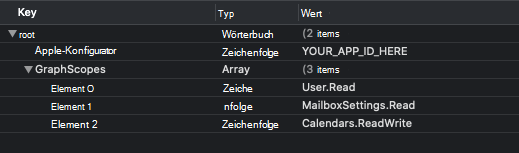

<!-- markdownlint-disable MD002 MD041 -->

<span data-ttu-id="a15ca-101">In dieser Übung erweitern Sie die Anwendung aus der vorherigen Übung, um die Authentifizierung mit Azure AD zu unterstützen.</span><span class="sxs-lookup"><span data-stu-id="a15ca-101">In this exercise you will extend the application from the previous exercise to support authentication with Azure AD.</span></span> <span data-ttu-id="a15ca-102">Dies ist erforderlich, um das erforderliche OAuth-Zugriffstoken zum Aufrufen von Microsoft Graph abzurufen.</span><span class="sxs-lookup"><span data-stu-id="a15ca-102">This is required to obtain the necessary OAuth access token to call the Microsoft Graph.</span></span> <span data-ttu-id="a15ca-103">Dazu integrieren Sie die [Microsoft Authentication Library (MSAL) für iOS](https://github.com/AzureAD/microsoft-authentication-library-for-objc) in die Anwendung.</span><span class="sxs-lookup"><span data-stu-id="a15ca-103">To do this, you will integrate the [Microsoft Authentication Library (MSAL) for iOS](https://github.com/AzureAD/microsoft-authentication-library-for-objc) into the application.</span></span>

1. <span data-ttu-id="a15ca-104">Erstellen Sie eine neue **Eigenschaftslistendatei** im **GraphTutorial-Projekt** mit dem Namen **AuthSettings.plist**.</span><span class="sxs-lookup"><span data-stu-id="a15ca-104">Create a new **Property List** file in the **GraphTutorial** project named **AuthSettings.plist**.</span></span>
1. <span data-ttu-id="a15ca-105">Fügen Sie der Datei im Stammverzeichnis die folgenden **Elemente** hinzu.</span><span class="sxs-lookup"><span data-stu-id="a15ca-105">Add the following items to the file in the **Root** dictionary.</span></span>

    | <span data-ttu-id="a15ca-106">Key</span><span class="sxs-lookup"><span data-stu-id="a15ca-106">Key</span></span> | <span data-ttu-id="a15ca-107">Typ</span><span class="sxs-lookup"><span data-stu-id="a15ca-107">Type</span></span> | <span data-ttu-id="a15ca-108">Wert</span><span class="sxs-lookup"><span data-stu-id="a15ca-108">Value</span></span> |
    |-----|------|-------|
    | `AppId` | <span data-ttu-id="a15ca-109">Zeichenfolge</span><span class="sxs-lookup"><span data-stu-id="a15ca-109">String</span></span> | <span data-ttu-id="a15ca-110">Die Anwendungs-ID aus dem Azure-Portal</span><span class="sxs-lookup"><span data-stu-id="a15ca-110">The application ID from the Azure portal</span></span> |
    | `GraphScopes` | <span data-ttu-id="a15ca-111">Array</span><span class="sxs-lookup"><span data-stu-id="a15ca-111">Array</span></span> | <span data-ttu-id="a15ca-112">Drei Zeichenfolgenwerte: `User.Read` `MailboxSettings.Read` , und `Calendars.ReadWrite`</span><span class="sxs-lookup"><span data-stu-id="a15ca-112">Three String values: `User.Read`, `MailboxSettings.Read`, and `Calendars.ReadWrite`</span></span> |

    

> [!IMPORTANT]
> <span data-ttu-id="a15ca-114">Wenn Sie Quellcodeverwaltung wie Git verwenden, wäre es jetzt ein guter Zeitpunkt, die **Datei "AuthSettings.plist"** aus der Quellcodeverwaltung auszuschließen, um versehentlich einen Leck für Ihre App-ID zu vermeiden.</span><span class="sxs-lookup"><span data-stu-id="a15ca-114">If you're using source control such as git, now would be a good time to exclude the **AuthSettings.plist** file from source control to avoid inadvertently leaking your app ID.</span></span>

## <a name="implement-sign-in"></a><span data-ttu-id="a15ca-115">Implementieren der Anmeldung</span><span class="sxs-lookup"><span data-stu-id="a15ca-115">Implement sign-in</span></span>

<span data-ttu-id="a15ca-116">In diesem Abschnitt konfigurieren Sie das Projekt für MSAL, erstellen eine Authentifizierungs-Manager-Klasse und aktualisieren die App so, dass sie sich anmeldet und abmeldet.</span><span class="sxs-lookup"><span data-stu-id="a15ca-116">In this section you will configure the project for MSAL, create an authentication manager class, and update the app to sign in and sign out.</span></span>

### <a name="configure-project-for-msal"></a><span data-ttu-id="a15ca-117">Konfigurieren des Projekts für MSAL</span><span class="sxs-lookup"><span data-stu-id="a15ca-117">Configure project for MSAL</span></span>

1. <span data-ttu-id="a15ca-118">Fügen Sie den Projektfunktionen eine neue Schlüsselbundgruppe hinzu.</span><span class="sxs-lookup"><span data-stu-id="a15ca-118">Add a new keychain group to your project's capabilities.</span></span>
    1. <span data-ttu-id="a15ca-119">Wählen Sie **das GraphTutorial-Projekt** aus, und signieren **& Funktionen.**</span><span class="sxs-lookup"><span data-stu-id="a15ca-119">Select the **GraphTutorial** project, then **Signing & Capabilities**.</span></span>
    1. <span data-ttu-id="a15ca-120">Wählen **Sie +Funktion** aus, und doppelklicken Sie dann **auf Schlüsselbundfreigabe.**</span><span class="sxs-lookup"><span data-stu-id="a15ca-120">Select **+ Capability**, then double-click **Keychain Sharing**.</span></span>
    1. <span data-ttu-id="a15ca-121">Fügen Sie eine Schlüsselbundgruppe mit dem Wert `com.microsoft.adalcache` hinzu.</span><span class="sxs-lookup"><span data-stu-id="a15ca-121">Add a keychain group with the value `com.microsoft.adalcache`.</span></span>

1. <span data-ttu-id="a15ca-122">Steuerelement klicken **Sie auf "Info.plist",** und wählen **Sie "Öffnen als"** und dann **"Quellcode" aus.**</span><span class="sxs-lookup"><span data-stu-id="a15ca-122">Control click **Info.plist** and select **Open As**, then **Source Code**.</span></span>
1. <span data-ttu-id="a15ca-123">Fügen Sie Folgendes innerhalb des Elements `<dict>` hinzu.</span><span class="sxs-lookup"><span data-stu-id="a15ca-123">Add the following inside the `<dict>` element.</span></span>

    ```xml
    <key>CFBundleURLTypes</key>
    <array>
      <dict>
        <key>CFBundleURLSchemes</key>
        <array>
          <string>msauth.$(PRODUCT_BUNDLE_IDENTIFIER)</string>
        </array>
      </dict>
    </array>
    <key>LSApplicationQueriesSchemes</key>
    <array>
        <string>msauthv2</string>
        <string>msauthv3</string>
    </array>
    ```

1. <span data-ttu-id="a15ca-124">Öffnen **Sie "AppDelegate.swift",** und fügen Sie die folgende Import-Anweisung am Anfang der Datei hinzu.</span><span class="sxs-lookup"><span data-stu-id="a15ca-124">Open **AppDelegate.swift** and add the following import statement at the top of the file.</span></span>

    ```Swift
    import MSAL
    ```

1. <span data-ttu-id="a15ca-125">Fügen Sie die folgende Funktion zur `AppDelegate`-Klasse hinzu:</span><span class="sxs-lookup"><span data-stu-id="a15ca-125">Add the following function to the `AppDelegate` class.</span></span>

    :::code language="swift" source="../demo/GraphTutorial/GraphTutorial/AppDelegate.swift" id="HandleMsalResponseSnippet":::

### <a name="create-authentication-manager"></a><span data-ttu-id="a15ca-126">Erstellen eines Authentifizierungs-Managers</span><span class="sxs-lookup"><span data-stu-id="a15ca-126">Create authentication manager</span></span>

1. <span data-ttu-id="a15ca-127">Erstellen Sie eine neue **Swift-Datei** im **GraphTutorial-Projekt** mit dem Namen **AuthenticationManager.swift**.</span><span class="sxs-lookup"><span data-stu-id="a15ca-127">Create a new **Swift File** in the **GraphTutorial** project named **AuthenticationManager.swift**.</span></span> <span data-ttu-id="a15ca-128">Fügen Sie den folgenden Code in die Datei ein:</span><span class="sxs-lookup"><span data-stu-id="a15ca-128">Add the following code to the file.</span></span>

    :::code language="swift" source="../demo/GraphTutorial/GraphTutorial/AuthenticationManager.swift" id="AuthManagerSnippet":::

### <a name="add-sign-in-and-sign-out"></a><span data-ttu-id="a15ca-129">Hinzufügen von Anmeldung und Abmelden</span><span class="sxs-lookup"><span data-stu-id="a15ca-129">Add sign-in and sign-out</span></span>

1. <span data-ttu-id="a15ca-130">Öffnen **Sie "SignInViewController.swift",** und ersetzen Sie den Inhalt durch den folgenden Code.</span><span class="sxs-lookup"><span data-stu-id="a15ca-130">Open **SignInViewController.swift** and replace its contents with the following code.</span></span>

    :::code language="swift" source="../demo/GraphTutorial/GraphTutorial/SignInViewController.swift" id="SignInViewSnippet":::

1. <span data-ttu-id="a15ca-131">Öffnen **Sie WelcomeViewController.swift,** und ersetzen Sie die vorhandene `signOut` Funktion durch Folgendes.</span><span class="sxs-lookup"><span data-stu-id="a15ca-131">Open **WelcomeViewController.swift** and replace the existing `signOut` function with the following.</span></span>

    :::code language="swift" source="../demo/GraphTutorial/GraphTutorial/WelcomeViewController.swift" id="SignOutSnippet":::

1. <span data-ttu-id="a15ca-132">Speichern Sie Ihre Änderungen, und starten Sie die Anwendung im Simulator neu.</span><span class="sxs-lookup"><span data-stu-id="a15ca-132">Save your changes and restart the application in Simulator.</span></span>

<span data-ttu-id="a15ca-133">Wenn Sie sich bei der App anmelden, sollte ein Zugriffstoken im Ausgabefenster in Xcode angezeigt werden.</span><span class="sxs-lookup"><span data-stu-id="a15ca-133">If you sign in to the app, you should see an access token displayed in the output window in Xcode.</span></span>


## <a name="get-user-details"></a><span data-ttu-id="a15ca-135">Benutzerdetails abrufen</span><span class="sxs-lookup"><span data-stu-id="a15ca-135">Get user details</span></span>

<span data-ttu-id="a15ca-136">In diesem Abschnitt erstellen Sie eine Hilfsklasse für alle Aufrufe von Microsoft Graph und aktualisieren die Klasse so, dass sie diese neue Klasse verwendet, um den angemeldeten `WelcomeViewController` Benutzer zu erhalten.</span><span class="sxs-lookup"><span data-stu-id="a15ca-136">In this section you will create a helper class to hold all of the calls to Microsoft Graph and update the `WelcomeViewController` to use this new class to get the logged-in user.</span></span>

1. <span data-ttu-id="a15ca-137">Erstellen Sie eine neue **Swift-Datei** im **GraphTutorial-Projekt** mit dem Namen **GraphManager.swift**.</span><span class="sxs-lookup"><span data-stu-id="a15ca-137">Create a new **Swift File** in the **GraphTutorial** project named **GraphManager.swift**.</span></span> <span data-ttu-id="a15ca-138">Fügen Sie den folgenden Code in die Datei ein:</span><span class="sxs-lookup"><span data-stu-id="a15ca-138">Add the following code to the file.</span></span>

    ```Swift
    import Foundation
    import MSGraphClientSDK
    import MSGraphClientModels

    class GraphManager {

        // Implement singleton pattern
        static let instance = GraphManager()

        private let client: MSHTTPClient?

        public var userTimeZone: String

        private init() {
            client = MSClientFactory.createHTTPClient(with: AuthenticationManager.instance)
            userTimeZone = "UTC"
        }

        public func getMe(completion: @escaping(MSGraphUser?, Error?) -> Void) {
            // GET /me
            let select = "$select=displayName,mail,mailboxSettings,userPrincipalName"
            let meRequest = NSMutableURLRequest(url: URL(string: "\(MSGraphBaseURL)/me?\(select)")!)
            let meDataTask = MSURLSessionDataTask(request: meRequest, client: self.client, completion: {
                (data: Data?, response: URLResponse?, graphError: Error?) in
                guard let meData = data, graphError == nil else {
                    completion(nil, graphError)
                    return
                }

                do {
                    // Deserialize response as a user
                    let user = try MSGraphUser(data: meData)
                    completion(user, nil)
                } catch {
                    completion(nil, error)
                }
            })

            // Execute the request
            meDataTask?.execute()
        }
    }
    ```

1. <span data-ttu-id="a15ca-139">Öffnen **Sie WelcomeViewController.swift,** und fügen Sie die folgende `import` Anweisung am Anfang der Datei hinzu.</span><span class="sxs-lookup"><span data-stu-id="a15ca-139">Open **WelcomeViewController.swift** and add the following `import` statement at the top of the file.</span></span>

    ```Swift
    import MSGraphClientModels
    ```

1. <span data-ttu-id="a15ca-140">Fügen Sie der `WelcomeViewController`-Klasse die folgende Eigenschaft hinzu.</span><span class="sxs-lookup"><span data-stu-id="a15ca-140">Add the following property to the `WelcomeViewController` class.</span></span>

    ```Swift
    private let spinner = SpinnerViewController()
    ```

1. <span data-ttu-id="a15ca-141">Ersetzen Sie das vorhandene `viewDidLoad` durch den folgenden Code.</span><span class="sxs-lookup"><span data-stu-id="a15ca-141">Replace the existing `viewDidLoad` with the following code.</span></span>

    :::code language="swift" source="../demo/GraphTutorial/GraphTutorial/WelcomeViewController.swift" id="ViewDidLoadSnippet":::

<span data-ttu-id="a15ca-142">Wenn Sie Ihre Änderungen speichern und die App jetzt neu starten, wird die Benutzeroberfläche nach der Anmeldung mit dem Anzeigenamen und der E-Mail-Adresse des Benutzers aktualisiert.</span><span class="sxs-lookup"><span data-stu-id="a15ca-142">If you save your changes and restart the app now, after sign-in the UI is updated with the user's display name and email address.</span></span>
