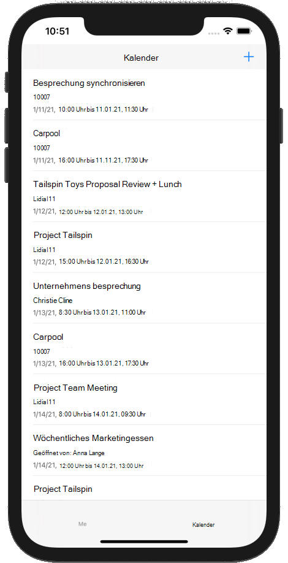

<!-- markdownlint-disable MD002 MD041 -->

<span data-ttu-id="f57c7-101">In dieser Übung integrieren Sie Microsoft Graph in die Anwendung.</span><span class="sxs-lookup"><span data-stu-id="f57c7-101">In this exercise you will incorporate the Microsoft Graph into the application.</span></span> <span data-ttu-id="f57c7-102">Für diese Anwendung verwenden Sie das [Microsoft Graph SDK für Objective C,](https://github.com/microsoftgraph/msgraph-sdk-objc) um Aufrufe an Microsoft Graph zu senden.</span><span class="sxs-lookup"><span data-stu-id="f57c7-102">For this application, you will use the [Microsoft Graph SDK for Objective C](https://github.com/microsoftgraph/msgraph-sdk-objc) to make calls to Microsoft Graph.</span></span>

## <a name="get-calendar-events-from-outlook"></a><span data-ttu-id="f57c7-103">Abrufen von Kalenderereignissen von Outlook</span><span class="sxs-lookup"><span data-stu-id="f57c7-103">Get calendar events from Outlook</span></span>

<span data-ttu-id="f57c7-104">In diesem Abschnitt erweitern Sie die Klasse, um eine Funktion hinzuzufügen, um die Ereignisse des Benutzers für die aktuelle Woche zu erhalten, und aktualisieren, um diese `GraphManager` `CalendarViewController` neuen Funktionen zu verwenden.</span><span class="sxs-lookup"><span data-stu-id="f57c7-104">In this section you will extend the `GraphManager` class to add a function to get the user's events for the current week and update `CalendarViewController` to use these new functions.</span></span>

1. <span data-ttu-id="f57c7-105">Öffnen **Sie GraphManager.swift,** und fügen Sie der Klasse die folgende Methode `GraphManager` hinzu.</span><span class="sxs-lookup"><span data-stu-id="f57c7-105">Open **GraphManager.swift** and add the following method to the `GraphManager` class.</span></span>

    ```Swift
    public func getCalendarView(viewStart: String,
                                viewEnd: String,
                                completion: @escaping(Data?, Error?) -> Void) {
        // GET /me/calendarview
        // Set start and end of the view
        let start = "startDateTime=\(viewStart)"
        let end = "endDateTime=\(viewEnd)"
        // Only return these fields in results
        let select = "$select=subject,organizer,start,end"
        // Sort results by when they were created, newest first
        let orderBy = "$orderby=start/dateTime"
        // Request at most 25 results
        let top = "$top=25"

        let eventsRequest = NSMutableURLRequest(url: URL(string: "\(MSGraphBaseURL)/me/calendarview?\(start)&\(end)&\(select)&\(orderBy)&\(top)")!)

        // Add the Prefer: outlook.timezone header to get start and end times
        // in user's time zone
        eventsRequest.addValue("outlook.timezone=\"\(self.userTimeZone)\"", forHTTPHeaderField: "Prefer")

        let eventsDataTask = MSURLSessionDataTask(request: eventsRequest, client: self.client, completion: {
            (data: Data?, response: URLResponse?, graphError: Error?) in
            guard let eventsData = data, graphError == nil else {
                completion(nil, graphError)
                return
            }

            // TEMPORARY
            completion(eventsData, nil)
        })

        // Execute the request
        eventsDataTask?.execute()
    }
    ```

    > [!NOTE]
    > <span data-ttu-id="f57c7-106">Überlegen Sie, was der Code `getCalendarView` gerade macht.</span><span class="sxs-lookup"><span data-stu-id="f57c7-106">Consider what the code in `getCalendarView` is doing.</span></span>
    >
    > - <span data-ttu-id="f57c7-107">Die URL, die aufgerufen wird, lautet `/v1.0/me/calendarview`.</span><span class="sxs-lookup"><span data-stu-id="f57c7-107">The URL that will be called is `/v1.0/me/calendarview`.</span></span>
    >   - <span data-ttu-id="f57c7-108">Die `startDateTime` Parameter `endDateTime` und Abfrageparameter definieren den Anfang und das Ende der Kalenderansicht.</span><span class="sxs-lookup"><span data-stu-id="f57c7-108">The `startDateTime` and `endDateTime` query parameters define the start and end of the calendar view.</span></span>
    >   - <span data-ttu-id="f57c7-109">Der Abfrageparameter beschränkt die für die einzelnen Ereignisse zurückgegebenen Felder auf die Felder, die `select` tatsächlich von der Ansicht verwendet werden.</span><span class="sxs-lookup"><span data-stu-id="f57c7-109">The `select` query parameter limits the fields returned for each events to just those the view will actually use.</span></span>
    >   - <span data-ttu-id="f57c7-110">Der `orderby` Abfrageparameter sortiert die Ergebnisse nach Startzeit.</span><span class="sxs-lookup"><span data-stu-id="f57c7-110">The `orderby` query parameter sorts the results by start time.</span></span>
    >   - <span data-ttu-id="f57c7-111">Der `top` Abfrageparameter fordert 25 Ergebnisse pro Seite an.</span><span class="sxs-lookup"><span data-stu-id="f57c7-111">The `top` query parameter requests 25 results per page.</span></span>
    >   - <span data-ttu-id="f57c7-112">Der Header bewirkt, dass Microsoft Graph die Start- und Endzeiten der einzelnen Ereignisse in der Zeitzone des `Prefer: outlook.timezone` Benutzers zurück gibt.</span><span class="sxs-lookup"><span data-stu-id="f57c7-112">the `Prefer: outlook.timezone` header causes the Microsoft Graph to return the start and end times of each event in the user's time zone.</span></span>

1. <span data-ttu-id="f57c7-113">Erstellen Sie eine neue **Swift-Datei** im **GraphTutorial-Projekt** mit dem Namen **GraphToIana.swift**.</span><span class="sxs-lookup"><span data-stu-id="f57c7-113">Create a new **Swift File** in the **GraphTutorial** project named **GraphToIana.swift**.</span></span> <span data-ttu-id="f57c7-114">Fügen Sie den folgenden Code in die Datei ein:</span><span class="sxs-lookup"><span data-stu-id="f57c7-114">Add the following code to the file.</span></span>

    :::code language="swift" source="../demo/GraphTutorial/GraphTutorial/GraphToIana.swift" id="GraphToIanaSnippet":::

    <span data-ttu-id="f57c7-115">Dies führt eine einfache Suche durch, um einen IANA-Zeitzonenbezeichner basierend auf dem von Microsoft Graph zurückgegebenen Zeitzonennamen zu finden.</span><span class="sxs-lookup"><span data-stu-id="f57c7-115">This does a simple lookup to find an IANA time zone identifier based on the time zone name returned by Microsoft Graph.</span></span>

1. <span data-ttu-id="f57c7-116">Öffnen **Sie CalendarViewController.swift,** und ersetzen Sie den gesamten Inhalt durch den folgenden Code.</span><span class="sxs-lookup"><span data-stu-id="f57c7-116">Open **CalendarViewController.swift** and replace its entire contents with the following code.</span></span>

    ```Swift
    import UIKit
    import MSGraphClientModels

    class CalendarViewController: UIViewController {

        @IBOutlet var calendarJSON: UITextView!

        private let spinner = SpinnerViewController()

        override func viewDidLoad() {
            super.viewDidLoad()

            // Do any additional setup after loading the view.
            self.spinner.start(container: self)

            // Calculate the start and end of the current week
            let timeZone = GraphToIana.getIanaIdentifier(graphIdentifer: GraphManager.instance.userTimeZone)
            let now = Date()
            var calendar = Calendar(identifier: .gregorian)
            calendar.timeZone = TimeZone(identifier: timeZone)!

            let startOfWeek = calendar.dateComponents([.calendar, .yearForWeekOfYear, .weekOfYear], from: now).date!
            let endOfWeek = calendar.date(byAdding: .day, value: 7, to: startOfWeek)!

            // Convert start and end to ISO 8601 strings
            let isoFormatter = ISO8601DateFormatter()
            let viewStart = isoFormatter.string(from: startOfWeek)
            let viewEnd = isoFormatter.string(from: endOfWeek)

            GraphManager.instance.getCalendarView(viewStart: viewStart, viewEnd: viewEnd) {
                (data: Data?, error: Error?) in
                DispatchQueue.main.async {
                    self.spinner.stop()

                    // TEMPORARY
                    guard let eventsData = data, error == nil else {
                        self.calendarJSON.text = error.debugDescription
                        return
                    }

                    let jsonString = String(data: eventsData, encoding: .utf8)
                    self.calendarJSON.text = jsonString
                    self.calendarJSON.sizeToFit()
                }
            }
        }
    }
    ```

<span data-ttu-id="f57c7-117">Sie können jetzt die App ausführen, sich anmelden und im Menü auf das **Navigationselement** "Kalender" tippen.</span><span class="sxs-lookup"><span data-stu-id="f57c7-117">You can now run the app, sign in, and tap the **Calendar** navigation item in the menu.</span></span> <span data-ttu-id="f57c7-118">Es sollte ein JSON-Dump der Ereignisse in der App angezeigt werden.</span><span class="sxs-lookup"><span data-stu-id="f57c7-118">You should see a JSON dump of the events in the app.</span></span>

## <a name="display-the-results"></a><span data-ttu-id="f57c7-119">Anzeigen der Ergebnisse</span><span class="sxs-lookup"><span data-stu-id="f57c7-119">Display the results</span></span>

<span data-ttu-id="f57c7-120">Jetzt können Sie das JSON-Dump durch eine benutzerfreundliche Anzeige der Ergebnisse ersetzen.</span><span class="sxs-lookup"><span data-stu-id="f57c7-120">Now you can replace the JSON dump with something to display the results in a user-friendly manner.</span></span> <span data-ttu-id="f57c7-121">In diesem Abschnitt ändern Sie die Funktion so, dass stark typierte Objekte und die Ereignisse mithilfe einer Tabellenansicht `getCalendarView` `CalendarViewController` gerendert werden.</span><span class="sxs-lookup"><span data-stu-id="f57c7-121">In this section, you will modify the `getCalendarView` function to return strongly-typed objects, and modify `CalendarViewController` to use a table view to render the events.</span></span>

1. <span data-ttu-id="f57c7-122">Öffnen **Sie GraphManager.swift**.</span><span class="sxs-lookup"><span data-stu-id="f57c7-122">Open **GraphManager.swift**.</span></span> <span data-ttu-id="f57c7-123">Ersetzen Sie die vorhandene `getCalendarView`-Funktion durch Folgendes.</span><span class="sxs-lookup"><span data-stu-id="f57c7-123">Replace the existing `getCalendarView` function with the following.</span></span>

    :::code language="swift" source="../demo/GraphTutorial/GraphTutorial/GraphManager.swift" id="GetEventsSnippet" highlight="3,28-49":::

1. <span data-ttu-id="f57c7-124">Erstellen Sie eine neue **Cocoa Touch Class-Datei** im **GraphTutorial-Projekt** mit dem Namen `CalendarTableViewController.swift` .</span><span class="sxs-lookup"><span data-stu-id="f57c7-124">Create a new **Cocoa Touch Class** file in the **GraphTutorial** project named `CalendarTableViewController.swift`.</span></span> <span data-ttu-id="f57c7-125">Wählen **Sie "UITableViewController"** in der **Unterklasse des Felds** aus.</span><span class="sxs-lookup"><span data-stu-id="f57c7-125">Choose **UITableViewController** in the **Subclass of** field.</span></span>

1. <span data-ttu-id="f57c7-126">Öffnen **Sie CalendarTableViewController.swift,** und ersetzen Sie den Inhalt durch Folgendes.</span><span class="sxs-lookup"><span data-stu-id="f57c7-126">Open **CalendarTableViewController.swift** and replace its contents with the following.</span></span>

    :::code language="swift" source="../demo/GraphTutorial/GraphTutorial/CalendarTableViewController.swift" id="CalendarTableViewControllerSnippet":::

1. <span data-ttu-id="f57c7-127">Erstellen Sie eine neue **Cocoa Touch Class-Datei** im **GraphTutorial-Projekt** mit dem Namen `CalendarTableViewCell.swift` .</span><span class="sxs-lookup"><span data-stu-id="f57c7-127">Create a new **Cocoa Touch Class** file in the **GraphTutorial** project named `CalendarTableViewCell.swift`.</span></span> <span data-ttu-id="f57c7-128">Wählen **Sie "UITableViewCell"** in der **Unterklasse des Felds** aus.</span><span class="sxs-lookup"><span data-stu-id="f57c7-128">Choose **UITableViewCell** in the **Subclass of** field.</span></span>

1. <span data-ttu-id="f57c7-129">Öffnen **Sie CalendarTableViewCell.swift,** und fügen Sie der Klasse die folgenden Eigenschaften `CalendarTableViewCell` hinzu.</span><span class="sxs-lookup"><span data-stu-id="f57c7-129">Open **CalendarTableViewCell.swift** and add the following properties to the `CalendarTableViewCell` class.</span></span>

    :::code language="swift" source="../demo/GraphTutorial/GraphTutorial/CalendarTableViewCell.swift" id="PropertiesSnippet":::

1. <span data-ttu-id="f57c7-130">Öffnen **Sie Main.storyboard,** und suchen Sie **die Kalender-Szene.**</span><span class="sxs-lookup"><span data-stu-id="f57c7-130">Open **Main.storyboard** and locate the **Calendar Scene**.</span></span> <span data-ttu-id="f57c7-131">Löschen Sie die Bildlaufansicht aus der Stammansicht.</span><span class="sxs-lookup"><span data-stu-id="f57c7-131">Delete the scroll view from the root view.</span></span>
1. <span data-ttu-id="f57c7-132">Fügen Sie **in der Bibliothek** oben in der **Ansicht** eine Navigationsleiste hinzu.</span><span class="sxs-lookup"><span data-stu-id="f57c7-132">Using the **Library**, add a **Navigation Bar** to the top of the view.</span></span>
1. <span data-ttu-id="f57c7-133">Doppelklicken Sie in **der** Navigationsleiste auf den Titel, und aktualisieren Sie ihn in `Calendar` .</span><span class="sxs-lookup"><span data-stu-id="f57c7-133">Double-click the **Title** in the navigation bar and update it to `Calendar`.</span></span>
1. <span data-ttu-id="f57c7-134">Fügen Sie **in der Bibliothek** rechts neben der Navigationsleiste ein Balkenschaltflächeelement hinzu. </span><span class="sxs-lookup"><span data-stu-id="f57c7-134">Using the **Library**, add a **Bar Button Item** to the right-hand side of the navigation bar.</span></span>
1. <span data-ttu-id="f57c7-135">Wählen Sie die Schaltfläche für die neue Leiste und dann den **Attributprüfungsinspektor aus.**</span><span class="sxs-lookup"><span data-stu-id="f57c7-135">Select the new bar button, then select the **Attributes Inspector**.</span></span> <span data-ttu-id="f57c7-136">Bild **in** Plus **ändern.**</span><span class="sxs-lookup"><span data-stu-id="f57c7-136">Change **Image** to **plus**.</span></span>
1. <span data-ttu-id="f57c7-137">Fügen Sie **der Ansicht unter der Navigationsleiste** eine **Containeransicht** aus der Bibliothek hinzu.</span><span class="sxs-lookup"><span data-stu-id="f57c7-137">Add a **Container View** from the **Library** to the view under the navigation bar.</span></span> <span data-ttu-id="f57c7-138">Ändern Sie die Größe der Containeransicht, um den verbleibenden Platz in der Ansicht zu übernehmen.</span><span class="sxs-lookup"><span data-stu-id="f57c7-138">Resize the container view to take all of the remaining space in the view.</span></span>
1. <span data-ttu-id="f57c7-139">Legen Sie Einschränkungen für die Navigationsleiste und die Containeransicht wie folgt ein.</span><span class="sxs-lookup"><span data-stu-id="f57c7-139">Set constraints on the navigation bar and container view as follows.</span></span>

    - <span data-ttu-id="f57c7-140">**Navigationsleiste**</span><span class="sxs-lookup"><span data-stu-id="f57c7-140">**Navigation Bar**</span></span>
        - <span data-ttu-id="f57c7-141">Einschränkung hinzufügen: Höhe, Wert: 44</span><span class="sxs-lookup"><span data-stu-id="f57c7-141">Add constraint: Height, value: 44</span></span>
        - <span data-ttu-id="f57c7-142">Einschränkung hinzufügen: Führendes Leerzeichen zum sicheren Bereich, Wert: 0</span><span class="sxs-lookup"><span data-stu-id="f57c7-142">Add constraint: Leading space to Safe Area, value: 0</span></span>
        - <span data-ttu-id="f57c7-143">Einschränkung hinzufügen: Nachgestellter Speicherplatz zum sicheren Bereich, Wert: 0</span><span class="sxs-lookup"><span data-stu-id="f57c7-143">Add constraint: Trailing space to Safe Area, value: 0</span></span>
        - <span data-ttu-id="f57c7-144">Einschränkung hinzufügen: Oberster Platz zum sicheren Bereich, Wert: 0</span><span class="sxs-lookup"><span data-stu-id="f57c7-144">Add constraint: Top space to Safe Area, value: 0</span></span>
    - <span data-ttu-id="f57c7-145">**Containeransicht**</span><span class="sxs-lookup"><span data-stu-id="f57c7-145">**Container View**</span></span>
        - <span data-ttu-id="f57c7-146">Einschränkung hinzufügen: Führendes Leerzeichen zum sicheren Bereich, Wert: 0</span><span class="sxs-lookup"><span data-stu-id="f57c7-146">Add constraint: Leading space to Safe Area, value: 0</span></span>
        - <span data-ttu-id="f57c7-147">Einschränkung hinzufügen: Nachgestellter Speicherplatz zum sicheren Bereich, Wert: 0</span><span class="sxs-lookup"><span data-stu-id="f57c7-147">Add constraint: Trailing space to Safe Area, value: 0</span></span>
        - <span data-ttu-id="f57c7-148">Einschränkung hinzufügen: Oberster Platz auf der Navigationsleiste unten, Wert: 0</span><span class="sxs-lookup"><span data-stu-id="f57c7-148">Add constraint: Top space to Navigation Bar Bottom, value: 0</span></span>
        - <span data-ttu-id="f57c7-149">Einschränkung hinzufügen: Unterer Platz zum sicheren Bereich, Wert: 0</span><span class="sxs-lookup"><span data-stu-id="f57c7-149">Add constraint: Bottom space to Safe Area, value: 0</span></span>

1. <span data-ttu-id="f57c7-150">Suchen Sie den zweiten Ansichtscontroller, der dem Storyboard hinzugefügt wurde, wenn Sie die Containeransicht hinzugefügt haben.</span><span class="sxs-lookup"><span data-stu-id="f57c7-150">Locate the second view controller added to the storyboard when you added the container view.</span></span> <span data-ttu-id="f57c7-151">Es wird durch eine **Einbettungs-Segue** mit der Kalenderszene verbunden.</span><span class="sxs-lookup"><span data-stu-id="f57c7-151">It is connected to the **Calendar Scene** by an embed segue.</span></span> <span data-ttu-id="f57c7-152">Wählen Sie diesen Controller aus, und verwenden Sie den **Identitätsinspektor,** um **die Klasse in** **CalendarTableViewController zu ändern.**</span><span class="sxs-lookup"><span data-stu-id="f57c7-152">Select this controller and use the **Identity Inspector** to change **Class** to **CalendarTableViewController**.</span></span>
1. <span data-ttu-id="f57c7-153">Löschen Sie **die Ansicht** aus dem **Kalender tabellenansichtscontroller**.</span><span class="sxs-lookup"><span data-stu-id="f57c7-153">Delete the **View** from the **Calendar Table View Controller**.</span></span>
1. <span data-ttu-id="f57c7-154">Fügen Sie dem  **Tabellenansichtscontroller des** Kalenders eine Tabellenansicht aus der **Bibliothek hinzu.**</span><span class="sxs-lookup"><span data-stu-id="f57c7-154">Add a **Table View** from the **Library** to the **Calendar Table View Controller**.</span></span>
1. <span data-ttu-id="f57c7-155">Wählen Sie die Tabellenansicht und dann den **Attributes Inspector aus.**</span><span class="sxs-lookup"><span data-stu-id="f57c7-155">Select the table view, then select the **Attributes Inspector**.</span></span> <span data-ttu-id="f57c7-156">Set **Prototype Cells** to **1**.</span><span class="sxs-lookup"><span data-stu-id="f57c7-156">Set **Prototype Cells** to **1**.</span></span>
1. <span data-ttu-id="f57c7-157">Ziehen Sie den unteren Rand der Prototypzelle, um Ihnen einen größeren Bereich für die Arbeit zu bieten.</span><span class="sxs-lookup"><span data-stu-id="f57c7-157">Drag the bottom edge of the prototype cell to give you a larger area to work with.</span></span>
1. <span data-ttu-id="f57c7-158">Verwenden Sie die **Bibliothek,** um **der** Prototypzelle drei Beschriftungen hinzuzufügen.</span><span class="sxs-lookup"><span data-stu-id="f57c7-158">Use the **Library** to add three **Labels** to the prototype cell.</span></span>
1. <span data-ttu-id="f57c7-159">Wählen Sie die Prototypzelle und dann den **Identitätsinspektor aus.**</span><span class="sxs-lookup"><span data-stu-id="f57c7-159">Select the prototype cell, then select the **Identity Inspector**.</span></span> <span data-ttu-id="f57c7-160">Ändern **Sie die Klasse** in **CalendarTableViewCell**.</span><span class="sxs-lookup"><span data-stu-id="f57c7-160">Change **Class** to **CalendarTableViewCell**.</span></span>
1. <span data-ttu-id="f57c7-161">Wählen Sie den **Attributes Inspector aus,** und legen **Sie den Bezeichner auf** . `EventCell`</span><span class="sxs-lookup"><span data-stu-id="f57c7-161">Select the **Attributes Inspector** and set **Identifier** to `EventCell`.</span></span>
1. <span data-ttu-id="f57c7-162">Wenn Die **EventCell ausgewählt** ist, wählen Sie den **Connections Inspector** und verbinden , und mit den Beschriftungen, die Sie der Zelle `durationLabel` im `organizerLabel` `subjectLabel` Storyboard hinzugefügt haben.</span><span class="sxs-lookup"><span data-stu-id="f57c7-162">With the **EventCell** selected, select the **Connections Inspector** and connect `durationLabel`, `organizerLabel`, and `subjectLabel` to the labels you added to the cell on the storyboard.</span></span>
1. <span data-ttu-id="f57c7-163">Legen Sie die Eigenschaften und Einschränkungen für die drei Beschriftungen wie folgt dar.</span><span class="sxs-lookup"><span data-stu-id="f57c7-163">Set the properties and constraints on the three labels as follows.</span></span>

    - <span data-ttu-id="f57c7-164">**Betreffbezeichnung**</span><span class="sxs-lookup"><span data-stu-id="f57c7-164">**Subject Label**</span></span>
        - <span data-ttu-id="f57c7-165">Einschränkung hinzufügen: Führendes Leerzeichen zum führenden Rand der Inhaltsansicht, Wert: 0</span><span class="sxs-lookup"><span data-stu-id="f57c7-165">Add constraint: Leading space to Content View Leading Margin, value: 0</span></span>
        - <span data-ttu-id="f57c7-166">Einschränkung hinzufügen: Nachgestellter Speicherplatz zum nachgestellten Rand der Inhaltsansicht, Wert: 0</span><span class="sxs-lookup"><span data-stu-id="f57c7-166">Add constraint: Trailing space to Content View Trailing Margin, value: 0</span></span>
        - <span data-ttu-id="f57c7-167">Einschränkung hinzufügen: Oberster Platz am oberen Rand der Inhaltsansicht, Wert: 0</span><span class="sxs-lookup"><span data-stu-id="f57c7-167">Add constraint: Top space to Content View Top Margin, value: 0</span></span>
    - <span data-ttu-id="f57c7-168">**Bezeichnung des Organisators**</span><span class="sxs-lookup"><span data-stu-id="f57c7-168">**Organizer Label**</span></span>
        - <span data-ttu-id="f57c7-169">Schriftart: System 12.0</span><span class="sxs-lookup"><span data-stu-id="f57c7-169">Font: System 12.0</span></span>
        - <span data-ttu-id="f57c7-170">Einschränkung hinzufügen: Höhe, Wert: 15</span><span class="sxs-lookup"><span data-stu-id="f57c7-170">Add constraint: Height, value: 15</span></span>
        - <span data-ttu-id="f57c7-171">Einschränkung hinzufügen: Führendes Leerzeichen zum führenden Rand der Inhaltsansicht, Wert: 0</span><span class="sxs-lookup"><span data-stu-id="f57c7-171">Add constraint: Leading space to Content View Leading Margin, value: 0</span></span>
        - <span data-ttu-id="f57c7-172">Einschränkung hinzufügen: Nachgestellter Speicherplatz zum nachgestellten Rand der Inhaltsansicht, Wert: 0</span><span class="sxs-lookup"><span data-stu-id="f57c7-172">Add constraint: Trailing space to Content View Trailing Margin, value: 0</span></span>
        - <span data-ttu-id="f57c7-173">Einschränkung hinzufügen: Oberster Platz im unteren Bereich der Betreffbezeichnung, Wert: Standard</span><span class="sxs-lookup"><span data-stu-id="f57c7-173">Add constraint: Top space to Subject Label Bottom, value: Standard</span></span>
    - <span data-ttu-id="f57c7-174">**Bezeichnung "Dauer"**</span><span class="sxs-lookup"><span data-stu-id="f57c7-174">**Duration Label**</span></span>
        - <span data-ttu-id="f57c7-175">Schriftart: System 12.0</span><span class="sxs-lookup"><span data-stu-id="f57c7-175">Font: System 12.0</span></span>
        - <span data-ttu-id="f57c7-176">Farbe: Dunkelgrau</span><span class="sxs-lookup"><span data-stu-id="f57c7-176">Color: Dark Gray Color</span></span>
        - <span data-ttu-id="f57c7-177">Einschränkung hinzufügen: Höhe, Wert: 15</span><span class="sxs-lookup"><span data-stu-id="f57c7-177">Add constraint: Height, value: 15</span></span>
        - <span data-ttu-id="f57c7-178">Einschränkung hinzufügen: Führendes Leerzeichen zum führenden Rand der Inhaltsansicht, Wert: 0</span><span class="sxs-lookup"><span data-stu-id="f57c7-178">Add constraint: Leading space to Content View Leading Margin, value: 0</span></span>
        - <span data-ttu-id="f57c7-179">Einschränkung hinzufügen: Nachgestellter Speicherplatz zum nachgestellten Rand der Inhaltsansicht, Wert: 0</span><span class="sxs-lookup"><span data-stu-id="f57c7-179">Add constraint: Trailing space to Content View Trailing Margin, value: 0</span></span>
        - <span data-ttu-id="f57c7-180">Einschränkung hinzufügen: Oberster Platz am unteren Rand der Bezeichnung "Organizer", Wert: Standard</span><span class="sxs-lookup"><span data-stu-id="f57c7-180">Add constraint: Top space to Organizer Label Bottom, value: Standard</span></span>
        - <span data-ttu-id="f57c7-181">Einschränkung hinzufügen: Unterer Bereich zum unteren Rand der Inhaltsansicht, Wert: 0</span><span class="sxs-lookup"><span data-stu-id="f57c7-181">Add constraint: Bottom space to Content View Bottom Margin, value: 0</span></span>

1. <span data-ttu-id="f57c7-182">Select the **EventCell,** then select the **Size Inspector**.</span><span class="sxs-lookup"><span data-stu-id="f57c7-182">Select the **EventCell**, then select the **Size Inspector**.</span></span> <span data-ttu-id="f57c7-183">Aktivieren **Sie "Automatisch** für **Zeilenhöhe".**</span><span class="sxs-lookup"><span data-stu-id="f57c7-183">Enable **Automatic** for **Row Height**.</span></span>

    

1. <span data-ttu-id="f57c7-185">Öffnen **Sie CalendarViewController.swift,** und ersetzen Sie den Inhalt durch den folgenden Code.</span><span class="sxs-lookup"><span data-stu-id="f57c7-185">Open **CalendarViewController.swift** and replace its contents with the following code.</span></span>

    :::code language="swift" source="../demo/GraphTutorial/GraphTutorial/CalendarViewController.swift" id="CalendarViewSnippet":::

1. <span data-ttu-id="f57c7-186">Führen Sie die App aus, melden Sie sich an, und tippen Sie auf die **Registerkarte "Kalender".** Die Liste der Ereignisse sollte angezeigt werden.</span><span class="sxs-lookup"><span data-stu-id="f57c7-186">Run the app, sign in, and tap the **Calendar** tab. You should see the list of events.</span></span>

    
