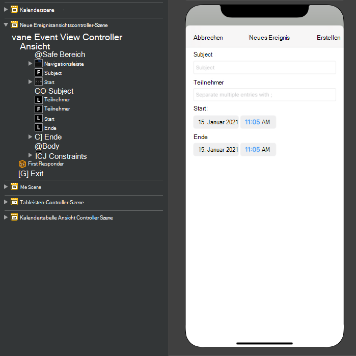
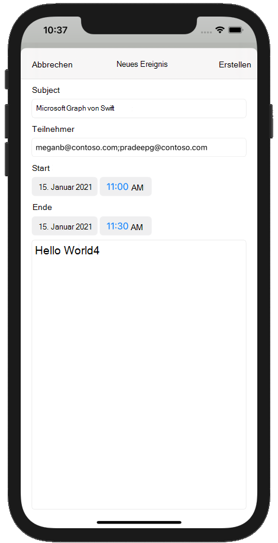

<!-- markdownlint-disable MD002 MD041 -->

In diesem Abschnitt fügen Sie die Möglichkeit zum Erstellen von Ereignissen im Kalender des Benutzers hinzu.In this section you will add the ability to create events on the user's calendar.

1. Öffnen **Sie GraphManager.swift,** und fügen Sie die folgende Funktion hinzu, um ein neues Ereignis im Kalender des Benutzers zu erstellen.Open **GraphManager.swift** and add the following function to create a new event on the user's calendar.

    :::code language="swift" source="../demo/GraphTutorial/GraphTutorial/GraphManager.swift" id="CreateEventSnippet":::

1. Erstellen Sie eine neue **Cocoa Touch Class-Datei** im **Ordner GraphTutorial** mit dem Namen `NewEventViewController` .Create a new **Cocoa Touch Class** file in the **GraphTutorial** folder named `NewEventViewController`. Wählen **Sie "UIViewController"** in der **Unterklasse des Felds** aus.Choose **UIViewController** in the **Subclass of** field.
1. Öffnen **Sie NewEventViewController.swift,** und ersetzen Sie den Inhalt durch Folgendes.Open **NewEventViewController.swift** and replace its contents with the following.

    :::code language="swift" source="../demo/GraphTutorial/GraphTutorial/NewEventViewController.swift" id="NewEventViewControllerSnippet":::

1. Öffnen **Sie Main.storyboard**.Open **Main.storyboard**. Verwenden Sie die **Bibliothek,** um einen **Ansichtscontroller auf** das Storyboard zu ziehen.Use the **Library** to drag a **View Controller** onto the storyboard.
1. Fügen Sie **mithilfe der Bibliothek** dem Ansichtscontroller eine **Navigationsleiste** hinzu.Using the **Library**, add a **Navigation Bar** to the view controller.
1. Doppelklicken Sie in **der** Navigationsleiste auf den Titel, und aktualisieren Sie ihn in `New Event` .Double-click the **Title** in the navigation bar and update it to `New Event`.
1. Fügen Sie in  **der Bibliothek** links neben der Navigationsleiste ein Balkenschaltflächeelement hinzu.Using the **Library**, add a **Bar Button Item** to the left-hand side of the navigation bar.
1. Wählen Sie die schaltfläche "Neue Leiste" und dann den **Attributprüfungsinspektor aus.**Select the new bar button, then select the **Attributes Inspector**. Ändern **Sie den Titel** in `Cancel` .Change **Title** to `Cancel`.
1. Fügen Sie **in der Bibliothek** rechts neben der Navigationsleiste ein Balkenschaltflächeelement hinzu. Using the **Library**, add a **Bar Button Item** to the right-hand side of the navigation bar.
1. Wählen Sie die schaltfläche "Neue Leiste" und dann den **Attributprüfungsinspektor aus.**Select the new bar button, then select the **Attributes Inspector**. Ändern **Sie den Titel** in `Create` .Change **Title** to `Create`.
1. Wählen Sie den Ansichtscontroller und dann den **Identitätsinspektor aus.**Select the view controller, then select the **Identity Inspector**. Ändern **Sie die Klasse** in **NewEventViewController**.Change **Class** to **NewEventViewController**.
1. Fügen Sie der Ansicht die folgenden Steuerelemente **aus der Bibliothek** hinzu.Add the following controls from the **Library** to the view.

    - Fügen Sie **eine Bezeichnung unter** der Navigationsleiste hinzu.Add a **Label** under the navigation bar. Legen Sie den Text auf `Subject` .Set its text to `Subject`.
    - Fügen Sie **unter der Beschriftung** ein Textfeld hinzu.Add a **Text Field** under the label. Legen Sie das **Platzhalterattribut auf** `Subject` .Set its **Placeholder** attribute to `Subject`.
    - Fügen Sie eine **Beschriftung** unter dem Textfeld hinzu.Add a **Label** under the text field. Legen Sie den Text auf `Attendees` .Set its text to `Attendees`.
    - Fügen Sie **unter der Beschriftung** ein Textfeld hinzu.Add a **Text Field** under the label. Legen Sie das **Platzhalterattribut auf** `Separate multiple entries with ;` .Set its **Placeholder** attribute to `Separate multiple entries with ;`.
    - Fügen Sie eine **Beschriftung** unter dem Textfeld hinzu.Add a **Label** under the text field. Legen Sie den Text auf `Start` .Set its text to `Start`.
    - Fügen Sie **eine Datumsauswahl** unter der Bezeichnung hinzu.Add a **Date Picker** under the label. Legen Sie den **bevorzugten Stil** auf **"Komprimier",** das Intervall auf **15** Minuten und die Höhe auf **35 fest.** Set its **Preferred Style** to **Compact**, its **Interval** to **15 minutes**, and its height to **35**.
    - Fügen Sie eine **Bezeichnung** unter der Datumsauswahl hinzu.Add a **Label** under the date picker. Legen Sie den Text auf `End` .Set its text to `End`.
    - Fügen Sie **eine Datumsauswahl unter** der Bezeichnung hinzu.Add a **Date Picker** under the label. Legen Sie den **bevorzugten Stil auf** **"Komprimier",** das Intervall **auf 15** Minuten und die Höhe auf **35 fest.** Set its **Preferred Style** to **Compact**, its **Interval** to **15 minutes**, and its height to **35**.
    - Fügen Sie **eine Textansicht** unter der Datumsauswahl hinzu.Add a **Text View** under the date picker.

1. Wählen Sie **den neuen Ereignisansichtscontroller aus,** und verwenden Sie den **Verbindungsinspektor,** um die folgenden Verbindungen herzustellen.Select the **New Event View Controller** and use the **Connection Inspector** to make the following connections.

    - Verbinden Sie die **Aktion "Empfangener** Abbruch" mit der Schaltfläche **"Abbrechen".**Connect the **cancel** received action to the **Cancel** bar button.
    - Verbinden Sie die **"createEvent** received"-Aktion mit der Schaltfläche **"Leiste** erstellen".Connect the **createEvent** received action to the **Create** bar button.
    - Verbinden Sie **den Betreff** mit dem ersten Textfeld.Connect the **subject** outlet to the first text field.
    - Verbinden Sie **den Ausgang der Teilnehmer** mit dem zweiten Textfeld.Connect the **attendees** outlet to the second text field.
    - Verbinden Sie **den Startausgang** mit der ersten Datumsauswahl.Connect the **start** outlet to the first date picker.
    - Schließen Sie **die Endauslaufe** mit der zweiten Datumsauswahl an.Connect the **end** outlet to the second date picker.
    - Verbinden Sie **den Textkörper** mit der Textansicht.Connect the **body** outlet to the text view.

1. Fügen Sie die folgenden Einschränkungen hinzu.Add the following constraints.

    - **Navigationsleiste****Navigation Bar**
        - Führendes Leerzeichen zum sicheren Bereich, Wert: 0Leading space to Safe Area, value: 0
        - Nachgestellter Bereich zum sicheren Bereich, Wert: 0Trailing space to Safe Area, value: 0
        - Oberster Platz zum sicheren Bereich, Wert: 0Top space to Safe Area, value: 0
        - Höhe, Wert: 44Height, value: 44
    - **Betreffbezeichnung****Subject Label**
        - Führendes Leerzeichen zum Rand "Ansicht", Wert: 0Leading space to View margin, value: 0
        - Nachgestellter Abstand zum Rand anzeigen, Wert: 0Trailing space to View margin, value: 0
        - Oberster Bereich zur Navigationsleiste, Wert: 20Top space to Navigation Bar, value: 20
    - **Betrefftextfeld****Subject Text Field**
        - Führendes Leerzeichen zum Rand "Ansicht", Wert: 0Leading space to View margin, value: 0
        - Nachgestellter Abstand zum Rand anzeigen, Wert: 0Trailing space to View margin, value: 0
        - Oberster Platz bis Betreffbezeichnung, Wert: StandardTop space to Subject Label, value: Standard
    - **Bezeichnung "Teilnehmer"****Attendees Label**
        - Führendes Leerzeichen zum Rand "Ansicht", Wert: 0Leading space to View margin, value: 0
        - Nachgestellter Abstand zum Rand anzeigen, Wert: 0Trailing space to View margin, value: 0
        - Oberster Abstand zum Betrefftextfeld, Wert: StandardTop space to Subject Text Field, value: Standard
    - **Teilnehmertextfeld****Attendees Text Field**
        - Führendes Leerzeichen zum Rand "Ansicht", Wert: 0Leading space to View margin, value: 0
        - Nachgestellter Abstand zum Rand anzeigen, Wert: 0Trailing space to View margin, value: 0
        - Oberster Platz für "Attendees"-Bezeichnung, Wert: StandardTop space to Attendees Label, value: Standard
    - **Bezeichnung starten****Start Label**
        - Führendes Leerzeichen zum Rand "Ansicht", Wert: 0Leading space to View margin, value: 0
        - Nachgestellter Abstand zum Rand anzeigen, Wert: 0Trailing space to View margin, value: 0
        - Oberster Abstand zum Betrefftextfeld, Wert: StandardTop space to Subject Text Field, value: Standard
    - **Auswahl für Startdatum****Start Date Picker**
        - Führendes Leerzeichen zum Rand "Ansicht", Wert: 0Leading space to View margin, value: 0
        - Nachgestellter Abstand zum Rand anzeigen, Wert: 0Trailing space to View margin, value: 0
        - Oberster Platz für "Attendees"-Bezeichnung, Wert: StandardTop space to Attendees Label, value: Standard
        - Höhe, Wert: 35Height, value: 35
    - **Endbeschriftung****End Label**
        - Führendes Leerzeichen zum Rand "Ansicht", Wert: 0Leading space to View margin, value: 0
        - Nachgestellter Abstand zum Rand anzeigen, Wert: 0Trailing space to View margin, value: 0
        - Oberster Platz bis Startdatumsauswahl, Wert: StandardTop space to Start Date Picker, value: Standard
    - **Enddatumsauswahl****End Date Picker**
        - Führendes Leerzeichen zum Rand "Ansicht", Wert: 0Leading space to View margin, value: 0
        - Nachgestellter Abstand zum Rand anzeigen, Wert: 0Trailing space to View margin, value: 0
        - Oberster Abstand bis Ende der Bezeichnung, Wert: StandardTop space to End Label, value: Standard
        - Höhe: 35Height: 35
    - **Textkörperansicht****Body Text View**
        - Führendes Leerzeichen zum Rand "Ansicht", Wert: 0Leading space to View margin, value: 0
        - Nachgestellter Abstand zum Rand anzeigen, Wert: 0Trailing space to View margin, value: 0
        - Oberster Bereich bis Enddatumsauswahl, Wert: StandardTop space to End Date Picker, value: Standard
        - Unterer Bereich bis Rand anzeigen, Wert: 0Bottom space to View margin, value: 0

    

1. Wählen Sie **die Kalenderszene** und dann den **Connections Inspector aus.**Select the **Calendar Scene**, then select the **Connections Inspector**.
1. Ziehen **Sie unter "Ausgelöste Segues"** den nicht ausgefüllten Kreis neben **manuell** auf den **Neuen Ereignisansichtscontroller** im Storyboard.Under **Triggered Segues**, drag the unfilled circle next to **manual** onto the **New Event View Controller** on the storyboard. Wählen **Sie im Popupmenü** modal "Present" aus.Select **Present Modally** in the pop-up menu.
1. Wählen Sie die gerade hinzugefügte Segue aus, und wählen Sie dann den **Attributes Inspector aus.**Select the segue you just added, then select the **Attributes Inspector**. Legen Sie das **Bezeichnerfeld** auf `showEventForm` .Set the **Identifier** field to `showEventForm`.
1. Verbinden Sie **die aktion "showNewEventForm** empfangen" mit der Schaltfläche der **+** Navigationsleiste.Connect the **showNewEventForm** received action to the **+** navigation bar button.
1. Speichern Sie die Änderungen, und starten Sie die App neu.Save your changes and restart the app. Wechseln Sie zur Kalenderseite, und tippen Sie auf die **+** Schaltfläche.Go to the calendar page and tap the **+** button. Füllen Sie das Formular aus, und tippen Sie auf **"Erstellen",** um ein neues Ereignis zu erstellen.Fill in the form and tap **Create** to create a new event.

    
